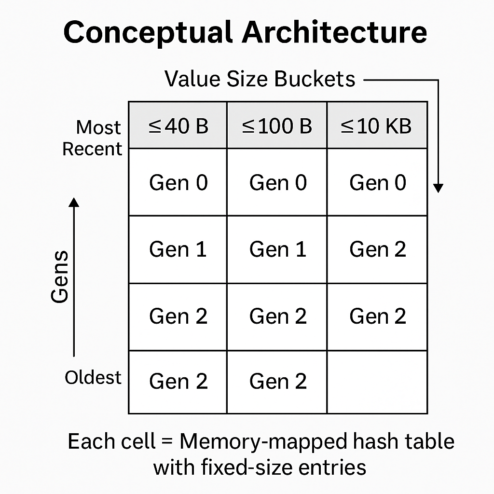
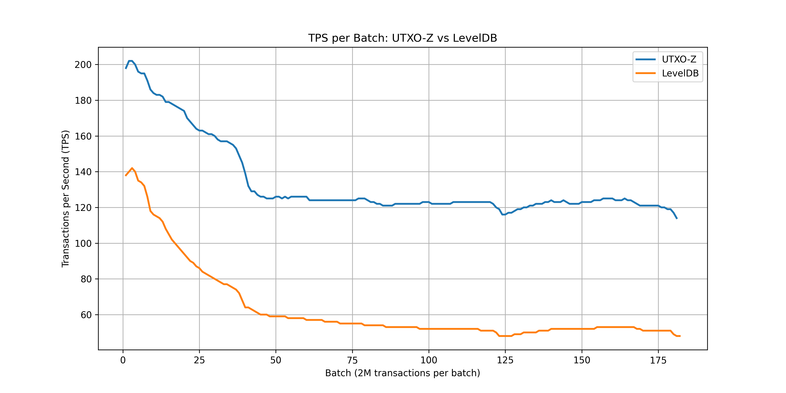

# 1. Introduction

To scale Bitcoin Cash as a global currency, nodes must be capable of validating thousands of transactions per second. This is not merely a theoretical target—it is a practical requirement if Bitcoin Cash is to serve as real-world electronic cash at planetary scale, fulfilling Satoshi's original vision of peer-to-peer electronic cash.

Every Bitcoin transaction consumes previous outputs (UTXOs) as inputs, and produces new outputs. The validation of those inputs requires retrieving the corresponding unspent outputs, which are stored in a data structure commonly known as the **UTXO set**.

Each input references a locking script from a previous output, and proper validation often involves executing scripts from both the current transaction and the referenced UTXO. Therefore, **the performance of UTXO lookups is directly tied to the throughput of transaction validation**.

Transaction validation is fundamentally a two-part process: **CPU-bound script verification** and **I/O-bound UTXO retrieval**. While script verification algorithms can be optimized for computational efficiency, achieving high validation throughput requires both fast cryptographic operations (CPU-bound) and rapid access to the referenced UTXOs (I/O-bound). Even with the most efficient signature verification algorithms, the overall validation pipeline will be constrained by whichever component is slower.

While script verification itself is computationally expensive, it cannot be parallelized effectively if the lookup of UTXOs becomes a bottleneck. Thus, **scaling validation throughput depends fundamentally on the performance of the UTXO set management system**. UTXO-Z addresses the I/O-bound portion of this equation, ensuring that UTXO retrieval does not become the limiting factor in high-throughput validation scenarios.

Additionally, efficient insertion and deletion of UTXOs is important—especially during initial block sync or reorgs—since these operations determine how quickly a node can become fully synced or recover from changes in chain history. This is particularly relevant for Bitcoin Cash, where larger blocks and higher transaction volumes amplify these performance requirements.

This document introduces **UTXO-Z**, a custom storage and lookup system designed specifically to address these challenges. Its design emphasizes memory layout, cache efficiency, and predictable performance under high transaction throughput—essential characteristics for supporting Bitcoin Cash's mission as global electronic cash.

# 2. Motivation and Problems with Traditional Approaches

Most existing Bitcoin node implementations use general-purpose key-value stores like LevelDB or LMDB to manage the UTXO set. While these storage engines are mature and flexible, they are not optimized for the specific access patterns and performance requirements of high-throughput Bitcoin validation.

The key limitations are:

- **Poor cache locality**: Traditional databases often rely on pointer-based structures like skip lists or B-trees, which scatter data in memory and reduce CPU cache efficiency during lookups.

- **Dynamic memory allocation overhead**: Variable-sized keys and values lead to fragmentation and additional indirection, making memory usage harder to predict and less efficient.

- **High lookup latency under load**: Validating blocks with thousands of transactions involves retrieving and verifying large numbers of UTXOs. If lookups are slow or cause page faults, the entire validation pipeline suffers. This creates an imbalance where fast CPU-bound script verification is throttled by slow I/O-bound UTXO access.

- **Suboptimal batch update performance**: When processing a block, many UTXOs must be removed (spent) and others inserted. Traditional databases do not handle these high-frequency bulk operations efficiently.

- **Lack of transparency and control**: General-purpose databases abstract away their internal layout and memory behavior, making it difficult to reason about or optimize performance.

These issues create serious bottlenecks when trying to scale Bitcoin Cash node throughput to support global use. Transaction validation cannot be parallelized effectively if UTXO access is serialized or stalls on memory or disk.

The UTXO-Z project was born out of the need to break these limitations by building a domain-specific storage engine that prioritizes cache locality, memory layout control, and predictable performance—key enablers for reaching the scale necessary to make Bitcoin Cash a truly global electronic cash system.

# 3. Core Design Principles

The architecture of the UTXO-Z system is grounded in a set of explicit design principles aimed at maximizing performance, predictability, and scalability:

### 3.1 Cache Locality First  
Data structures are designed to be **cache-friendly**, prioritizing memory layouts that minimize pointer chasing and improve CPU prefetch efficiency. This led to the use of **open addressing** hash tables over pointer-heavy alternatives.

### 3.2 Fixed-Size Buckets by Value Size  
UTXOs are grouped by the size of their values (primarily the size of the locking script). Each group uses a separate hash table with a **fixed value size**, eliminating the need for dynamic memory allocation and allowing tight packing of data.

### 3.3 Generational Storage  
Each value-size group is organized into **generations**: when a hash table reaches its capacity, a new file (generation) is created. Older generations remain accessible, and lookups may span across them. This supports fast inserts without triggering costly reallocations or merges.

### 3.4 Mutable Storage with Controlled Compaction  
Unlike append-only systems, older files may be **mutated** to delete spent outputs. A **compaction process** can be triggered to reduce fragmentation and merge sparse files when necessary, keeping the total number of files and memory mappings under control.

### 3.5 Deferred Lookup  
Lookups do not scan all generations immediately. Instead, if a key is not found in the most recent generation, the query is **deferred and batched**, allowing multiple lookups to be resolved in fewer passes across older generations. This reduces the cost of memory remapping and improves overall efficiency.

### 3.6 Memory-Mapped Files  
All storage is backed by **memory-mapped files**, giving the OS control over caching and paging. This avoids manual cache management and takes advantage of the system's virtual memory infrastructure for high-throughput read access.

### 3.7 No General Abstraction Layers  
To preserve performance and transparency, the system avoids introducing generic wrappers or abstractions (e.g., database APIs). Instead, it works directly with raw memory buffers and file-backed arrays, giving full control over layout and access.

### 3.8 Full Output Inlining (No Indirection)  
Each UTXO entry in UTXO-Z stores the **complete output data in-place**, including the full locking script and amount. This means lookups return the full usable result without needing to follow pointers or reconstruct the output from external sources like block files.

This design avoids the **extra memory access** and **I/O latency** associated with indirection-based schemes, where the UTXO database stores a reference to another storage layer. It also significantly simplifies and accelerates **pruning**, since UTXOs are self-contained and do not depend on the long-term retention of block data.

By storing everything inline, UTXO-Z favors speed and simplicity over space optimization—an intentional tradeoff aligned with its performance goals.

# 4. Cache Locality and Open Addressing Hash Tables

One of the most fundamental design decisions in UTXO-Z is the use of **hash tables with open addressing** to maximize cache locality.

Traditional hash maps or databases often rely on pointer-based structures such as linked lists or trees to resolve collisions. While flexible, these structures spread data across non-contiguous memory locations, leading to frequent cache misses and degraded CPU performance—especially when performing large numbers of lookups during block validation.

In contrast, open addressing keeps data in **contiguous memory blocks**, with each key-value pair stored directly within the probe sequence. This layout greatly improves **cache line utilization** and **CPU prefetching**, allowing more efficient scanning and lookup under heavy workloads.

Key advantages of this approach:

- **No pointer chasing**: All relevant data is likely to be on the same or adjacent cache lines.
- **Compact memory footprint**: No overhead from dynamically allocated nodes or wrappers.
- **Predictable performance**: Linear probing with a well-chosen load factor yields consistent lookup and insertion times.
- **Better CPU scaling**: High cache efficiency reduces contention and improves multicore parallelism.

This low-level architectural choice is what enables the rest of the system to scale. Whether inserting, deleting, or reading UTXOs, performance is tightly linked to memory access patterns. By designing from the ground up with cache locality in mind, UTXO-Z avoids a common class of performance bottlenecks present in most general-purpose storage engines.

# 5. UTXO Segmentation by Value Size

In the Bitcoin protocol, transaction outputs (UTXOs) can vary significantly in size, primarily due to the length of their locking scripts. A standard P2PKH output may be around 34 bytes, while an OP_RETURN output or complex contract could be several kilobytes in size. Bitcoin Cash's support for larger scripts and innovative use cases like CashTokens and advanced smart contracts further emphasizes the importance of handling this size diversity efficiently.

To avoid the inefficiencies of allocating space for variable-sized values in a single hash table, **UTXO-Z segments the UTXOs into separate groups based on their maximum value size**. Each segment has its own dedicated hash table, with a fixed-size value slot tailored to the expected maximum size within that segment.

For example:

- One segment may store standard outputs with values up to 40 bytes.
- Another may handle outputs up to 100 bytes.
- A third segment may allow up to 10,000 bytes for edge-case scripts or special use cases.

Each segment uses the same open addressing layout, but with a different fixed-size slot per entry.

### 5.1 Advantages of Segmentation

- **Eliminates memory waste**: No need to overallocate space in small outputs just to accommodate large ones.
- **Avoids dynamic allocation**: Fixed-size entries eliminate the need for heap allocations or indirection.
- **Enables predictable file size and memory usage**: Each segment grows linearly with the number of UTXOs in that size class.
- **Improves cache efficiency**: Tighter packing of small outputs reduces working set size and improves lookup speed.

This segmentation strategy is a key part of UTXO-Z's performance model. It embraces the reality that most outputs fall into a few well-defined size classes, and optimizes for that fact explicitly.

# 6. Generational Storage

Each value-size segment in UTXO-Z is internally divided into **generations**, where each generation corresponds to a file-backed hash table that stores a bounded number of UTXOs.

When a generation reaches its capacity, a new one is created and becomes the active target for all new insertions. Older generations remain readable, and deletions may affect any generation where a matching UTXO exists.

This strategy allows the system to grow incrementally without reallocating large regions of memory or rewriting existing data.

### 6.1 Key Characteristics

- **Append-style growth, mutable contents**: New UTXOs are inserted into the newest generation, while deletions may occur in any existing generation.
- **Chronological ordering**: Generations are strictly ordered by creation time. This ordering is leveraged by the lookup strategy.
- **Independent memory mapping**: Each generation is backed by a separate memory-mapped file. This lets the OS manage memory efficiently and avoids loading the entire dataset at once.
- **Segment-level isolation**: Generations exist within each size segment. There is no cross-contamination of generations between value-size classes.

### 6.2 Benefits

- **Improved insertion performance**: Adding new UTXOs doesn't require resizing or rehashing existing tables.
- **Fast failure on lookup**: Most active UTXOs are found in the most recent generation, so lookup operations tend to succeed early in the search chain.
- **Simplified compaction logic**: Since each generation is isolated, compaction (when needed) can be done one generation at a time without locking or rewriting the full dataset.

Generational storage gives UTXO-Z a natural temporal structure: recent data is hot, old data is cold, and the system can take advantage of this to optimize memory access and lookup behavior.

# 7. Deferred Lookup Strategy

A key insight behind UTXO-Z is that the vast majority of UTXOs being accessed during block validation are **recent**. Since UTXOs are stored in generational order—from newest to oldest—this temporal bias can be exploited to reduce the cost of lookups.

Rather than scanning all generations in order on every lookup, UTXO-Z employs a **deferred lookup strategy**:

1. A lookup first checks the most recent generation.
2. If the key is not found, it is **not immediately searched** in older generations.
3. Instead, the query is **deferred**—temporarily stored in a pending list.
4. After all immediate lookups are processed, the deferred queries are **batched** and scanned efficiently against the next older generation.
5. The process repeats until all generations are covered or the lookups are resolved.

### 7.1 Why This Matters

- **Reduces memory remapping costs**: Older generations may be memory-mapped on demand. Deferring queries lets the system group accesses and avoid repeated mappings.
- **Avoids repeated failed lookups**: Many keys will only exist in one generation. Immediate linear scanning of all generations would waste time and cache.
- **Takes advantage of temporal locality**: Since most lookups hit recent generations, early success rates are high and deeper generations are rarely needed.

This strategy is particularly effective during **block validation**, where thousands of inputs may reference recently created outputs. Grouping unresolved lookups allows UTXO-Z to process them in a cache-efficient and I/O-aware manner, while avoiding excessive indirection or per-key overhead.

The deferred lookup mechanism is tightly coupled with the generational layout and is a key enabler of high throughput under realistic transaction workloads.

# 8. Overall Structure: Distributed Hash Table

UTXO-Z is conceptually organized as a **distributed hash table**, but not in the networked sense. Instead, the distribution occurs **within the local filesystem and memory layout**, across multiple independent hash tables segmented by both **value size** and **generation**.

The full UTXO-Z structure can be visualized as a two-dimensional grid:

- Horizontally: multiple **value size buckets** (e.g., <=40 bytes, <=100 bytes, <=10,000 bytes).
- Vertically: multiple **generations** within each bucket, representing chronological layers of insertion.

Each cell in this grid is a **memory-mapped, fixed-size hash table** using open addressing, tuned specifically to that value size and allocated only when needed.

### 8.1 Conceptual Architecture

{ width=40% }

### 8.2 Key Characteristics

- **Independent growth**: Each value-size bucket grows its own generations independently, based on insertion volume.
- **No global coordination**: There is no centralized index or meta-layer. Each bucket+generation is self-contained and can be searched or compacted in isolation.
- **Parallel-friendly layout**: Since buckets and generations are independent, they can be accessed or compacted in parallel, enabling future concurrency and parallel validation enhancements.
- **Predictable memory footprint**: Each table has fixed-size entries, and the total number of tables can be bounded by generation policies and compaction thresholds.

This architecture avoids monolithic structures and central coordination, embracing locality and isolation instead. It enables the system to scale naturally with workload, maintain high performance across I/O and memory, and remain debuggable and deterministic.

The distributed layout of UTXO-Z is what makes it both **scalable and introspectable**, even at large chain sizes.

# 9. Per-File Metadata for Efficient Operations

Each generation file in UTXO-Z maintains its own lightweight **metadata block**, stored alongside the actual hash table data. This metadata provides just enough information to accelerate common operations—without introducing centralized coordination or global indexes.

### 9.1 Examples of Per-File Metadata

- **Number of occupied slots**: Helps estimate density and determine when compaction is beneficial.
- **Boundaries of keys**: Optionally stores min/max key hashes or bloom filters to allow fast skipping of unrelated generations during lookup.
- **Dirty flag or tombstone counts**: Tracks whether deletions have accumulated, indicating potential for cleanup.
- **File size and capacity info**: Encodes how many entries the table can hold and how full it is.
- **Last modification timestamp**: Used to prioritize compaction or assess generation staleness.

### 9.2 Benefits of Local Metadata

- **No central index required**: Each generation is self-describing. Global coordination or bookkeeping is unnecessary.
- **Faster deferred lookup passes**: Metadata can short-circuit lookups if it shows the key is definitely not present.
- **Efficient compaction triggers**: Generations can be selected for compaction based on their own local statistics, without scanning the full system.
- **Debugging and observability**: Tools can read per-file metadata directly to analyze system state, fragmentation, or cache pressure.

This approach balances **simplicity, performance, and introspection**. It allows UTXO-Z to make intelligent operational decisions—such as when to compact, evict, or skip files—without the overhead of a centralized control plane.

# 10. Performance Evaluation

To validate UTXO-Z's design and quantify its performance advantages, we conducted comprehensive benchmarks comparing it against LevelDB, the most widely used UTXO storage engine in Bitcoin implementations.

## 10.1 Benchmark Methodology

We designed two synthetic benchmarks that simulate realistic node workloads:

### Test 1: Simulated Initial Block Download (IBD)
- **Purpose**: Simulate a node syncing from genesis without network latency or block validation overhead
- **Data**: Real BCH blocks from height 0 to 789,999
- **Process**: Sequential single-threaded processing, focusing exclusively on UTXO set operations
- **Batch size**: ~2 million transactions per synthetic block to simulate future large blocks

### Test 2: Parallel Lookup Stress Test
- **Purpose**: Evaluate concurrent lookup performance under heavy parallel access
- **Setup**: UTXO database populated up to block 749,999
- **Test data**: Lookup inputs from blocks 750,000 to 789,000 using real transaction data
- **Thread counts**: 1, 2, 4, 8, 16, 32, and 64 threads
- **Metrics**: Total throughput (complete lookup pipeline) and direct throughput (recent subset only)

### Hardware Configuration
- **CPU**: AMD Ryzen Threadripper PRO 5995WX (64 cores / 128 threads)
- **RAM**: 96 GiB DDR4 @ 2400 MT/s
- **Storage**: 1.8 TB NVMe
- **OS**: Fedora Linux 40 (Kernel 6.10.4)

## 10.2 Results

### Simulated IBD Performance

*Note: All throughput figures are in thousands per second (k/sec).* 

UTXO-Z demonstrated superior performance throughout the entire blockchain synchronization:

- **LevelDB:**
    - Transactions throughput: mean 48k/sec, peak 140k/sec
    - Inputs throughput: mean 117k/sec, peak ~341k/sec
    - Outputs throughput: mean 129k/sec, peak ~376k/sec

- **UTXO-Z:**
    - Transactions throughput: mean 119k/sec, peak 202k/sec
    - Inputs throughput: mean 290k/sec, peak ~492k/sec
    - Outputs throughput: mean 320k/sec, peak ~543k/sec

- **Performance ratio**: UTXO-Z proved to be **up to 2.5× faster** than LevelDB

- **Scalability:** Performance remained stable despite progressive UTXO set growth

The performance gap widened in later batches, where LevelDB showed degradation while UTXO-Z maintained consistent throughput.

### Parallel Lookup Performance

The concurrent access test revealed even more dramatic differences:

**LevelDB Performance:**
- Peak: ~740k lookups/second with 64 threads
- Saturation: Performance plateaued beyond 16 threads
- Scaling: Minimal gains from additional parallelism

**UTXO-Z Performance:**
- **Total throughput**: Up to **1.5 million lookups/second** (complete lookup pipeline)
- **Direct throughput**: Up to **33 million lookups/second** (recent subset lookups)
- **Scaling**: Continued performance gains up to 64 threads

### Key Insights

1. **Real-world patterns**: Tests used actual blockchain data to ensure realistic UTXO spending patterns, avoiding synthetic workloads that might misrepresent lookup behavior.

2. **Temporal locality**: The vast performance difference in direct lookups (33M/sec) demonstrates UTXO-Z's effective exploitation of temporal locality—most spent UTXOs are relatively recent.

3. **Complete pipeline performance**: Even with sequential deferred lookup processing, UTXO-Z achieves >2× the total throughput of LevelDB.

4. **Optimization potential**: The 22× gap between direct and total throughput indicates significant room for improvement through parallelizing deferred lookups.

## 10.3 Performance Visualization

{ width=100% }

## 10.4 Important Considerations

**These benchmarks measure isolated UTXO database performance only**. The numbers presented represent pure database operations (UTXO-Z or LevelDB) running in isolation, without:

- Transaction validation or script execution
- Integration within a full node implementation
- Network overhead or block propagation
- Concurrent mempool operations

When integrated into a complete node with full transaction validation, these numbers will likely decrease as the system handles the complete validation pipeline. However, the relative performance advantages of UTXO-Z over traditional approaches should remain significant.

**A comprehensive study including full node integration and transaction validation performance will be presented in future work.**

# 11. Implementation Roadmap and Future Optimizations

While UTXO-Z already delivers significant performance gains through careful design, we have identified specific optimizations that could push performance even closer to theoretical limits:

### 11.1 Near-term Performance Optimizations

**Parallelize deferred lookups**: Currently sequential processing is the primary bottleneck for total throughput. Parallelizing this component could potentially increase total throughput from 1.5M to several million lookups per second.

**Predictive indexing**: Machine learning models to predict optimal subset locations for UTXOs based on spending patterns, potentially reducing the deferred lookup set by 50-80%.

**Enhanced metadata**: Per-subset bloom filters or range indexes to eliminate unnecessary generation scans, reducing I/O operations.

**Parameter auto-tuning**: Dynamic adjustment of segment sizes, file sizes, and buffer management based on workload characteristics.

### 11.2 Long-term Architectural Enhancements

**Write-Ahead Logging**: A lightweight WAL implementation for improved crash resilience without sacrificing performance, using per-bucket journals to avoid global coordination.

**Adaptive compaction**: Intelligent heuristics that consider access patterns, cache hit rates, and generation age to optimize space and performance dynamically.

**Memory-pressure adaptation**: Runtime feedback mechanisms to adjust memory usage under system pressure, potentially integrating with cgroups and memory controllers.

**Comprehensive diagnostics**: Built-in metrics collection for lookup latency percentiles, generation hit ratios, and compaction efficiency to enable data-driven optimization.

**Hardware-specific optimizations**: Leverage NUMA-aware memory allocation, CPU-specific SIMD instructions, and potentially GPU acceleration for batch operations.

### 11.3 Integration Roadmap

The path from isolated database to production-ready node component involves:

1. **Phase 1** (Current): Core database engine with isolated benchmarks
2. **Phase 2**: Integration with Bitcoin Cash node implementations
3. **Phase 3**: Production testing with full validation pipeline
4. **Phase 4**: Performance optimization based on real-world metrics
5. **Phase 5**: Release of production-ready implementation

Each phase will include comprehensive benchmarking and community review to ensure UTXO-Z meets the demanding requirements of global-scale Bitcoin Cash.

# 12. Conclusion

UTXO-Z is a purpose-built UTXO management system designed from the ground up to meet the performance demands of a globally scalable Bitcoin Cash network.

By rejecting general-purpose databases in favor of domain-specific structures—such as cache-friendly open addressing, segmentation by value size, generational storage, and deferred lookups—UTXO-Z achieves a level of control and efficiency that traditional approaches cannot match.

**Our performance evaluation demonstrates that UTXO-Z delivers on its design promises**: up to 2.5× faster blockchain synchronization and over 2× higher concurrent lookup throughput compared to LevelDB, with the architectural foundation to support even greater improvements.

The system favors **predictable performance, low memory overhead, and high cache locality**, even when handling tens of millions of UTXOs. Its file-based architecture, combined with per-generation metadata and optional compaction, allows it to scale naturally while remaining introspectable and prune-friendly.

Rather than optimizing for space at the cost of complexity and indirection, UTXO-Z keeps **complete output data inline**, enabling fast validation, efficient pruning, and straightforward logic for insertions and deletions.

While there are still future improvements to explore, UTXO-Z already provides a robust foundation for high-throughput transaction validation—an essential building block for turning Bitcoin Cash into the truly global, peer-to-peer electronic cash system envisioned by Satoshi Nakamoto.

By optimizing the I/O-bound component of transaction validation, UTXO-Z ensures that the computational power dedicated to script verification and cryptographic operations can be fully utilized without being bottlenecked by slow UTXO access. This balanced approach to both CPU-bound and I/O-bound performance is crucial for achieving the validation speeds necessary for global-scale electronic cash.

As Bitcoin Cash continues to grow and evolve, UTXO-Z stands ready to support the performance demands of a world where digital cash serves billions of users with the speed, reliability, and efficiency that global commerce requires.

**Note on Implementation Status**: The complete implementation of UTXO-Z is currently under active development. This paper presents the complete architectural design, technical foundation, and initial performance benchmarks. Additional implementation details and production-ready code will be released in subsequent phases as development progresses.

# 13. Acknowledgments

This work was made possible through the generous support of the Bitcoin Cash community via a successful Flipstarter campaign titled "Scalability Lab". Special thanks to all contributors who believed in the vision of high-performance UTXO management for Bitcoin Cash: majamalu, molecular, and toorik.

We also extend our gratitude to all the historical supporters of the Knuth node campaigns, whose continued faith in advancing Bitcoin Cash infrastructure has been invaluable.

The original Flipstarter campaign recognized that "Scalability is critical for Bitcoin Cash to become a global currency" and emphasized the need to address performance bottlenecks before they become critical limitations. UTXO-Z represents one of the key outcomes of this research initiative, focusing specifically on UTXO set structure and storage optimization—one of the core areas identified in the campaign.

Most importantly, we thank the entire Bitcoin Cash community—developers, miners, merchants, and users—who continue to push the boundaries of what's possible with peer-to-peer electronic cash. Your passion and dedication inspire innovations like UTXO-Z that bring us closer to Satoshi's vision of a truly global digital currency.

The pursuit of scaling Bitcoin Cash to serve the world is a collective effort, and UTXO-Z represents just one piece of the larger puzzle. Together, we're building the financial infrastructure for human freedom, ensuring that Bitcoin Cash can handle the transaction volumes necessary to serve as global electronic cash.